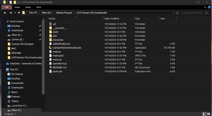

# UCF Canvas File Downloader
It can be a hassle having to download all the course files from all the classes, especially when they are constantly updated and you have to keep checking them. 
This is where the **UCF Canvas File Downloader** comes into play!

## SETUP
The **UCF Canvas File Downloader** is a stand-alone executable file, so it is very easy to setup. 

Just download the latest version in the package releases and store the executable in a folder on your system!

